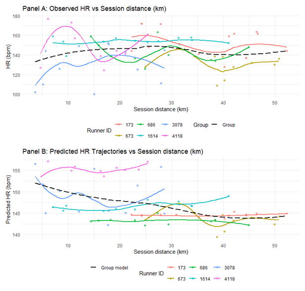
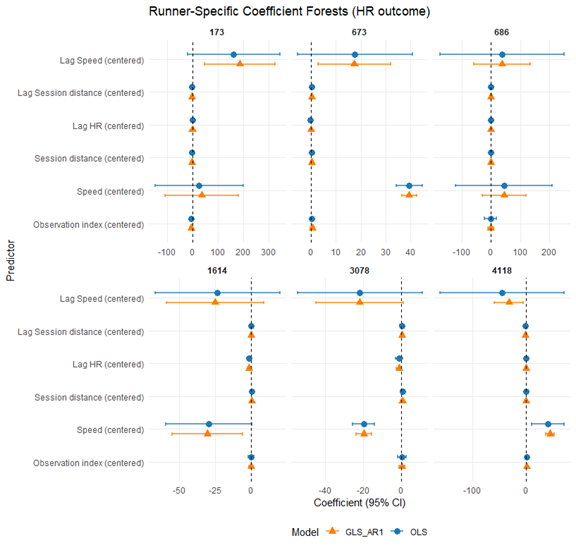

```{r}
#| echo: false
#| warning: false
#| message: false

source("R/bayesian_cmj_simulation.R")
```


Abstract: |
Monitoring strategies are used to assess athletes’ physical readiness to maximize performance. These data are used to assist practitioners and coaches in making decisions about the volume and intensity of the upcoming training, practice, and competition. Often, these measurements are serial in nature, where the athlete is evaluated for longitudinal changes over the course of a competitive season. The target of these strategies is commonly directed at determining whether the athlete has recovered from the most frequent bout of training or competition or adapted to the current training. Sport scientists seek to identify individualized athlete changes from serial measurements to understand how the athlete is responding to their training and competitive demands to optimize performance. Within this paper, we demonstrate novel individualistic probabilistic Bayesian methods that improve analytical based decisions concerning true athletic changes during serial (i.e., repeated) measures. We then discuss practical examples, providing open access computer code and data, to assist the practitioner in creating future scalable resources.

...
Plain-Language-Summary: | Evaluating and understanding if a true change occured from repeated measurments in athletic settings is essential for performance, injury risk assessment, and rehabilitation. We provide practical examples, with adjoining open data and code to help sports scientists in creating practical resources. 
  
Key-points:
  - The paper addresses a common sport science problem: Practitioners routinely collect repeated performance data, such as countermovement jump testing, to monitor athlete readiness, fatigue, recovery, and adaptation. A central challenge is determining whether an observed change reflects a true physiological change or is simply the result of measurement error. 

-Traditional threshold-based approaches have limitations: Common approaches for evaluating athlete monitoring data include: 1) Smallest Worthwhile Change (SWC); 2) Typical Error of Measurement (TEM); 3) Standard Error of Measurement (SEM); 4) Coefficient of Variation (CV). While these methods are widely used, they often lead to binary conclusions such as "changed" versus "not changed" and do not adequately communicate uncertainty surrounding the observed measurement. 

-The paper advocates for individual-level analysis: Sport performance decisions are ultimately made for individual athletes, yet most statistical methods taught in sport science are designed for group-level inference. The authors therefore advocate for: 1)N-of-1 methods; 2)Single-subject analysis; 3) Idiographic approaches. These methods better align with real-world athlete monitoring, where practitioners are interested in understanding changes within a specific athlete rather than average effects across a group. 

-Bayesian methods align with practitioner decision-making: Coaches and practitioners rarely need a simple yes-or-no answer regarding athlete status. Instead, they need to understand the probability that a meaningful change has occurred. Bayesian methods combine prior information about the measurement process with an athlete's observed data to estimate the likelihood that a meaningful change has occurred, thereby supporting more informed and context-specific decisions.

---

## Introduction

Professional and collegiate sports represent a high-stakes environment, where winning is critical to improving the financial vitality of the team and ensuring coaches and players retain their jobs. Consequently, the availability of the best players to be their best come game day is of the highest importance [@Ward2018]. This has created an interest in monitoring strategies to assess athletes’ physical readiness and track progress over time in an effort to mitigate injuries or decreases in performance [@Swinton2018; @Weakley2024; @Weakley2021]. These data are used to assist practitioners and coaches in making decisions about the volume and intensity of the upcoming practice week [@Weakley2024]. Often, these measurements are serial in nature, where the athlete is evaluated for longitudinal changes over the course of a competitive season [@Datson2022]. The target of these strategies is commonly directed at exploring whether the athlete has recovered from the most frequent bout of exercise or competition or adapted to the current training [@Harry2024].

McLean and colleagues [@McLean2010] used a weekly countermovement jump test to identify decrements in neuromuscular output in professional rugby athletes at 24, 48, and 72 hours post-match. They found that rugby athletes often exhibit declines in neuromuscular performance at 48 hours following competition, indicating that coaches and practitioners should be sensitive to the training intensity applied during this time given that the athletes are not completely recovered [@McLean2010]. Similar approaches to understanding when neuromuscular output has returned to baseline following competition have been explored in Australian football [@Kinsella2012], soccer [@ArmadaCortes2022], and basketball [@Sanders2019]. Unlike medical evaluations, where there is a defined endpoint (e.g., injury or illness) [@Mchunu2022], these monitoring approaches in sport science are often devoid of a target outcome. Rather, the practitioner is observing an underlying process over time (i.e., neuromuscular recovery or strength gains) and attempting to react to changes in that process if outcomes differ from what would normally be expected [@Hecksteden2017; @McLean2010]. For example, changes in the countermovement jump test are not directly linked to in-game performance but instead signal practitioners that deleterious changes that limit physical ability may be occurring [@McLean2010].

Ultimately, the practitioner is seeking to answer the question, *“How confident are we that the change we observe today is meaningful enough to intervene or make an adjustment to the planned training program?”* Answering this question is not an easy task, as analyzing such longitudinal data requires the sport scientist to consider statistical approaches that may be foreign to what they have been taught during their education. Most statistics courses in sport science university programs focus on analyzing group-level data [@Harry2024], as in well-designed studies that describe the average behavior of a sample population [@Beltz2016]. Often, this leads to analysis that compares the observed change to a set threshold, such as the Smallest Worthwhile Change (SWC) [@Turner2015], Coefficient of Variation [@Brown1998], or Typical Error of Measurement (TEM) [@Perini2005]. While such approaches to analysis may be useful for broader inference, sport deals with individuals, and group analysis often lacks generalizability to the individual level [@Bullock2023].

The interest in individual athlete analysis and limitations of group-based analysis in elite sport has led to more attention being placed on single-subject or N-of-1 research designs [@McDonald2020]. These methods have been commonly used in medicine, social work, and psychology. Recently, Bullock and colleagues [@Bullock2023] suggested the use of single-subject analysis and natural experiments in elite sport environments, where randomized controlled trials would not be feasible. Additionally, individualizing such analysis allows for the utilization of probabilistic measures to aid in decision-making [@Ward2018]. Threshold-based outputs, such as comparing change to a smallest worthwhile change (SWC) or typical error of measurement (TEM), lead to dichotomous thinking where the athlete has either observed a change or not. However, modeling the probability that the observed performance is meaningfully different from a threshold value allows for a more comprehensive discussion of risk [@Sottas2007]. For example, Hecksteden [@Hecksteden2017] applied a Bayesian approach to assessing fatigue in elite soccer athletes, weighting prior knowledge and observed creatine kinase levels to leverage a posterior distribution that explains the probability of the observed outcome.

Sport scientists require methodological approaches that can identify individualized athlete changes from serial measurements to understand how the athlete is responding to their training and competitive demands. There is currently a paucity of sport analytical methods that adequately assist the sports scientist in determining if a true change occurred in longitudinal training or competition. This inhibits sports scientists’ ability to make informed decisions and optimize athlete performance. Thus, in this paper we demonstrate novel individual-level probabilistic Bayesian methods that improve practical decision-making about true athletic changes across serial (i.e., repeated) measures. We then discuss practical examples, providing open-access computer code and data, to assist practitioners in creating future scalable resources.


## Materials and Methods

### Analytical Considerations

There are multiple statistical considerations when integrating serial testing at the individual level. Key analytical definitions are reported in @tbl-definitions.

::: {#tbl-definitions tbl-cap="Key Analytical Definitions"}

| Term | Definition | Example |
|------|------------|---------|
| **Observed Score** | An athlete's true measurement plus error.  $Y_i = n + e_i$ | An athlete's true countermovement jump height is 50 cm; however, due to measurement error, the countermovement jump height is measured at 52 cm. |
| **Variance** | A measure of dispersion. In other words, a measure of how far a set of numbers is spread out from their average value.  $\sigma^2(Y_i)=\sigma^2(n)+\sigma^2(e)$. **Where:** $\sigma^2(Y_i)$ = total variance; $\sigma^2(n)$ = true variance; $\sigma^2(e)$ = error variance. | An athlete is tested three times for countermovement jump height. The jump heights were 52 cm, 54 cm, and 50 cm, with an error of 2 cm for each jump. This results in a true variance of $4^2 = 16$ and an error variance of $6^2 = 36$, resulting in a total variance of $\sqrt{16+36}=7.2$. |
| **Autocorrelation** | The correlation of multiple measurements from one person or group, violating the assumption of independent measures. When multiple measurements are taken from the same individual or group, these measurements are not independent. Instead, they tend to be correlated because of shared characteristics or underlying factors. These nested structures introduce dependency that must be corrected for to ensure valid inferences. | As one athlete performed all three jumps, these jumps violated the assumption of independence and thus were autocorrelated. |
| **Intraclass Correlation Coefficient (ICC)** | A statistical measurement that quantifies how much of the observed variance comes from a change in the score of interest (between individuals or time points) relative to the total variance. $ICC = \frac{\text{variance of the player}}{\text{total variance}}$ | Using the previous countermovement jump example, a player has one day of jump-height testing of 52, 54, and 50 cm. The next week, the player performs jumps of 50, 52, and 54 cm. This results in an ICC of 0.33. |
| **Typical Error of Measurement (TEM) or Standard Error of Measurement (SEM)** | How much a score or test varies over repeated measurements without observing a true change. This defines the range around the observed score that is likely to contain the true score. $TEM = \frac{SD_{\text{difference}}}{\sqrt{2}}$ (*between two measurements*). Alternate formula: $TEM = SD \times \sqrt{1-ICC}$. | Using the countermovement jump example, a player is measured with jump heights of 52, 54, and 50 cm on day one and 50, 52, and 54 cm the next week. The standard deviation of these measures is 1.63. Taking the ICC of 0.33, the TEM is $1.63 \times \sqrt{1-0.33}$. The TEM/SEM is 1.33 cm. |
| **Smallest Worthwhile Change (SWC)** | The minimal improvement in performance that holds practical significance. This is subjective in many cases. A common method is Cohen's *d* effect size of 0.2 multiplied by the between-subject standard deviation. | Using the example above, the standard deviation is 1.63. The equation is $0.2 \times 1.63$. The SWC is 0.32 cm. |
| **Minimal Difference (MD)** | $MD = SEM \times 1.96 \times \sqrt{2}$ (*between two measurements*). | Using the SEM example, the SEM from the repeated measurements is 1.33 cm. The minimal difference is $1.33 \times 1.96 \times \sqrt{2}$. The MD is 3.7 cm. |
| **Bayesian Posterior Mean** | $r \times \text{test difference} + (1-r) \times \text{population mean}$, where *r* = prior ICC; test difference = difference between two tests; population mean = prior mean; population variance = prior TEM variance. | A practitioner observes a countermovement jump power test difference of -418. With prior literature showing an ICC of 0.834 and a population mean of 3.79, Bayesian updating yields a posterior mean of -348.6. |
| **Bayesian Posterior Standard Deviation** | $\sqrt{r \times \text{population variance}}$, where *r* = prior ICC and population variance is the prior TEM variance. | A practitioner observes a countermovement jump power test difference of -418. With prior literature showing an ICC of 0.834, Bayesian updating yields a posterior standard deviation of 90.6. |

:::
#### Single Subject Analysis

Single-subject analysis, also known as idiographic or more commonly as N-of-1 methods, utilizes repeated measures from one participant, allowing individualized conclusions about specific tests and interventions [@Beltz2016]. N-of-1 designs are different than case series, as precise conclusions using scientifically rigorous methods are employed [@Bullock2023; @McDonald2020]. N-of-1 approaches have previously been applied in fields such as personalized medicine [@VanDerGreef2006] and psychology [@Woodworth2016], allowing for a generalizable and scalable scientific method. Moreover, such approaches are directly meaningful to the practitioner who often uses published scientific findings coupled with the unique information being observed or reported by the athlete they are working with to build an individualized approach to treatment or training [@Bullock2023]. Incorporating N-of-1 strategies for serial sport testing therefore has the potential to reveal individual athlete-specific changes.

#### Bayesian Versus Frequentist Approaches

Statistical worldviews, and the approaches that come from them, can be broadly categorized as either frequentist or Bayesian [@BlandAltman1998]. Both offer unique advantages and disadvantages, which we briefly review here [@BlandAltman1998]. In the most general sense, frequentist approaches rely on long-run frequency to establish probabilities, which are considered properties of the data [@BlandAltman1998]. In contrast, the Bayesian approach views probabilities as representing a degree of belief (or uncertainty) about an estimate given the available data and prior knowledge [@Gelman1995].

Scientific approaches to identifying whether an outcome observed on a test is outside of a reference range are commonplace in health and medicine [@Hecksteden2017]. Unfortunately, many of these approaches rely on a single observation relative to a population-derived threshold used to differentiate between "abnormal" and "normal" responses. Such an approach leads to dichotomous thinking, fails to account for uncertainty and error in the test procedure, and limits the practitioner's ability to make probabilistic statements regarding their level of confidence in a recent observation [@AltmanRoyston2006]. Assessing the probability that a recent test observation is outside the normal range can be useful for making decisions about potential interventions and has been discussed in both cancer research [@McIntosh2024; @McIntosh2025] and anti-doping applications [@Sottas2007].

Given the serial nature of repeated testing and within-individual correlation, statisticians have advocated for dynamically adapting reference ranges using Bayesian methodologies to combine prior knowledge of the test in the specific population with the individual's repeated testing history [@Schechter1988]. McIntosh and colleagues [@McIntosh2024; @McIntosh2025] applied such individualized approaches to repeated cancer screening, enabling earlier identification of cancer diagnoses compared with traditional thresholds. Similarly, Sottas and colleagues [@Sottas2007] developed the Athlete Biological Passport for anti-doping applications, facilitating earlier identification of abnormal longitudinal biomarker patterns. These methodologies have also influenced sport science research, including the probability of fatigue or recovery [@Hecksteden2017] and dynamically updating biomarker reference ranges [@Roshan2021].

Interestingly, these approaches all have a clear endpoint of interest, such as cancer diagnosis [@McIntosh2024; @McIntosh2025], doping violations [@Sottas2007], or fatigue status [@Hecksteden2017]. In many applied sport science settings, however, monitoring is conducted weekly or bi-weekly without a clearly defined outcome [@McLean2010]. For example, McLean and colleagues [@McLean2010] observed suppressed neuromuscular performance 48 hours post-match in professional rugby athletes, providing useful information for strength and conditioning practitioners seeking to adjust training loads. However, these observations are not directly linked to a specific outcome and instead serve as information to guide practitioner decision-making. Consequently, analytical approaches that quantify uncertainty regarding whether an observation lies outside the expected range provide an opportunity for more nuanced discussions between practitioners and coaches about appropriate interventions.

Both frequentist and Bayesian approaches seek to determine whether a change requiring adjustment by the coach or practitioner has occurred [@Hecksteden2017; @Schechter1988]. The underlying assumptions and processes used to reach those conclusions differ. The relative merits of these approaches have been extensively debated [@BlandAltman1998], and revisiting those arguments is beyond the scope of this paper. Instead, our goal is to provide a practical rationale for adopting a Bayesian approach. As discussed previously, the inference of interest is the likelihood that a meaningful change has occurred given the score observed today [@Gelman1995].

The philosophical distinction is important. With a Bayesian approach, we estimate the likelihood of a change and provide this information to the coach, allowing contextual knowledge to be incorporated into the decision-making process [@Nayak2001]. For example, while an observation may suggest a reasonable probability of change, a coach may adjust that interpretation based on knowledge of the athlete's recent training, illness status, or competition schedule. Conversely, contextual information may increase concern about a seemingly modest change. This differs from approaches that rely solely on statistical rules to flag changes. We are not suggesting that probabilistic approaches cannot be applied using other methods. Rather, we believe the Bayesian framework aligns closely with how practitioners naturally reason and make decisions while ensuring that all available information is retained through the decision-making process.

Ultimately, a likelihood-based approach can provide a critical advantage by supporting practitioners as they integrate statistical evidence with contextual expertise [@Nayak2001]. Whether identifying a specific endpoint such as cancer diagnosis [@McIntosh2024; @McIntosh2025], doping violations [@Sottas2007], or guiding weekly training decisions [@MacLehose2014], Bayesian methods help ensure that relevant information reaches the decision-maker in a form that supports more calibrated and informed decisions.

## Practical Example

Longitudinal testing is conducted in applied sport settings as a means of gathering insights about an athlete's current physiological state [@Heishman2020]. As with all testing, both systematic and random error are inherent components of the measurement protocol [@AltmanRoyston2006; @Nayak2001]. When observing weekly measurements in athletes, such error clouds the primary question practitioners seek to answer: *"If this week's observation is substantially different from last week's observation, how certain can we be that this change is real and requires an intervention?"* Consequently, an individual's *true score* on a test can be conceptualized as a combination of the observed score and measurement error [@Altman1983]. One approach to accounting for error while incorporating prior knowledge about the test procedure is Bayes' theorem [@BlandAltman1998; @MacLehose2014; @Schechter1988]. Briefly, Bayes' theorem combines prior information about a measurement, including population expectations and measurement error, with an athlete's observed score to generate a posterior distribution of plausible true values [@Gelman1995].

While application of Bayes' theorem to continuous outcomes, which comprise many serial measurements in sport, can be mathematically complex and computationally intensive, relatively simple algorithms can be leveraged if practitioners are willing to assume specific data characteristics such as normality and homoscedasticity [@Schechter1988]. These approaches are straightforward to implement in spreadsheet software and provide rapid results that facilitate decision-making regarding an athlete's estimated true value. Additionally, posterior distributions allow practitioners to make direct probabilistic statements regarding observed changes [@Gelman1995]. The aim of this practical example is to provide practitioners with a simple method for evaluating repeated testing data while accounting for both systematic and random measurement error.

### Data Simulation

To demonstrate Bayesian updating within a sport science context, we simulated weekly testing of peak concentric power for an athlete who performed countermovement jump testing twice per week [@Heishman2020]. The athlete completed three countermovement jumps with arm swing during each session, and the average peak concentric power across the three attempts was used for analysis. To better reflect real-world conditions, missing data were introduced for two testing periods. Parameters used to generate the simulation are reported in @tbl-simulation-parameters. A visualization of the simulated testing data is provided in @fig-serial-power.

To demonstrate Bayesian updating within a sport science context, we simulated weekly testing of peak concentric power for an athlete who performed countermovement jump testing twice per week [@Heishman2020]. The athlete completed three countermovement jumps with arm swing during each session, and the average peak concentric power across the three attempts was used for analysis. To better reflect real-world conditions, missing data were introduced for two testing periods. Parameters used to generate the simulation are reported in @tbl-simulation-parameters. A visualization of the simulated testing data is provided in @fig-serial-power.

::: {#tbl-simulation-parameters tbl-cap="Model Parameters for Simulation"}

| Variable | Value |
|-----------|------:|
| Number of Tests | 45 |
| Average Peak Power | 5000 |
| Weekly Trend | 2 |
| Seasonal Variation | 100 |
| Random Noise | 150 |

:::

{#fig-serial-power}


The practitioner’s goal is to identify changes in weekly test scores that are outside of normal – i.e. larger than a smallest meaningful change - to plan interventions or suggest changes to weekly training that may help the athlete recover and perform at a higher level. Unfortunately, this goal is complicated by the fact that the true change observed on a given day is the aggregation of the athletes true score plus some amount of error. A plot of the test-to-test differences and the pooled standard deviation between subsequent tests can be observed in Figure 2. 


{#fig-change}

To add greater context to the visual, we plot the observed peak concentric power for each test along with the rolling 5-test average and rolling 5-test standard deviation (@fig-rolling). The rolling 5-test average and standard deviation were selected as a pragmatic balance for this situation, long enough to reflect meaningful physiological adaptation (2 to 3 weeks), but short enough to remain sensitive to acute changes when testing twice per week.

{#fig-rolling}

### Obtaining Standard Error of Measurement and Minimal Detectable Change

The most important aspect of Bayesian analysis is the information contained in the prior [@Gelman1995]. The prior is used to weight the evidence of the observed score to obtain a more reasonable estimate of the true value, termed the posterior. Priors can be selected using subjective expert judgement, pilot studies, or prior research [@Gelman1995]. In this example, we obtain the Smallest Worthwhile Change and Intraclass Correlation Coefficient for peak concentric power reported by Heishman and colleagues, who examined the intra-day reliability of several countermovement jump variables in NCAA basketball players [@Heishman2020]. These prior parameters are summarized in @tbl-prior-parameters. Since our interest is in making an inference about the observed change between subsequent tests, we specify the prior mean change as 0. In other words, our prior belief is that athletes exhibit little to no change from one test to the next.

::: {#tbl-prior-parameters tbl-cap="Prior Parameters for Peak Concentric Power"}

| Variable | Value |
|-----------|------:|
| Number of Subjects | 22 |
| Number of Measurements | 44 |
| Typical Error | 99.2 |
| Intraclass Correlation Coefficient (ICC) | 0.834 |
| Smallest Worthwhile Change | 296.2 |

:::


### Calculating the Posterior

There are a number of approaches one can use to combine the observed data with the prior parameters. To make this tutorial palatable for the practitioner, we refrain from writing mathematical notation and instead provide the details of the underlying math in plain English. Readers interested in investigating other potential approaches to estimating the posterior with this type of data and understanding the mathematical proofs are encouraged to consult external resources [@Bolstad2016; @Gelman1995]. We combine the observed data and prior parameters using the approach described by Schechter and Adler [@Schechter1988] to obtain a posterior mean and standard error of measurement.

: Prior Parameters for Peak Concentric Power from Heishman et al. (2020) {#tbl-prior}

### Drawing Inference

After calculating the posterior mean and standard error of measurement for each test difference, we plot the results to observe how the prior parameters help weigh the observed values and pull more extreme values closer to the mean (@fig-posterior). The plot reflects the observed changes against a fixed smallest worthwhile change threshold (grey shaded region), which is the value obtained from Heishman and colleagues [@Heishman2020].

{#fig-posterior}

Exploring @fig-posterior, it is clear that many points are within the normal range of the smallest worthwhile change, indicating that a meaningful enough difference from one test to the next has not occurred for the practitioner to be concerned about. However, this plot may be challenging for practitioners because the data are not reflected in the actual units of measurement, but rather differences from test to test. Such a plot prevents a clear observation of trends over time. To aid the practitioner, we recommend a time-series plot, as shown in @fig-timeseries, with the added context of coloring the points when a meaningful change from one test to the next has been observed. Here, we create a simulation for every observation using the Bayesian posterior mean and posterior standard deviation and provide the probability of each change being greater than or less than a threshold of interest, defined as the 5-test rolling standard deviation. When the probability of a positive or negative change exceeds 50%, we flag that point in blue or red, respectively, so that the practitioner can further investigate and gather more information about the athlete's status.

{#fig-timeseries}

Individual observations can be further emphasized by visualizing a histogram of a Monte Carlo simulation using the posterior mean and standard deviation and the smallest worthwhile change as threshold lines (Appendix). For example, in @fig-distribution we see a full posterior distribution for observation 20. Here, the probability that the change in peak concentric power from test 19 to test 20 was below the threshold of interest (rolling 5-test standard deviation of 233) was 38.3%. The visual is easy for the practitioner to understand because the shaded region reflects the density of the distribution (38.3%) residing below the threshold of interest.

{#fig-distribution}

Finally, we can create team-level evaluations for each athlete at each testing occasion (@fig-team), allowing meaningful changes to be easily identified across the entire squad. This information prevents the practitioner from thinking about changes in a binary way and instead facilitates more meaningful discussions about when to intervene in a player's training based on the probability that a true difference has been observed [@West2025]. This decision may be impacted by multiple factors not included in the monitoring process, such as the player's role on the team (starter versus reserve) or timing within the season (early season versus playoffs), where some risks may be more acceptable than others [@West2025]. Ultimately, this approach ensures that the decision-maker has access to the full posterior information from the monitoring tests while acknowledging that other contextual factors should influence the final decision. These methods are designed to ensure that all available information is delivered to the decision-maker so that contextually informed decisions can be made.

{#fig-team}

## Practical Applications

Bayesian estimates of change offer an easy and efficient way for data-driven exercise and sport science practitioners to evaluate the likelihood that a true change has occurred during repeated testing measures. These analyses can be used as an early warning system or to confirm whether a positive or negative change truly occurred based on an observed measurement. This paper provides practical examples from the authors' experience using Bayesian change-point analysis in sport and includes accompanying simulated data and code to reproduce these results and serve as a template for practitioners wishing to apply these methods to their own exercise and sport data.

## Conclusion

Sports scientists have a difficult job. One of the most challenging aspects is evaluating individual athletes over time and making sound decisions in a high-stakes environment. Many approaches used to evaluate serial measurements dichotomize data before it reaches the decision-maker [@AltmanRoyston2006], leading to decisions that fail to consider the probability of all potential outcomes. In contrast, the simple individual Bayesian method demonstrated here provides practitioners with the full posterior distribution, thereby improving the information available for training, practice, and competition decisions. This comprehensive probabilistic approach better informs knowledge users tasked with making data-driven decisions in sport.

## References {.unnumbered}

:::{#refs}

:::
